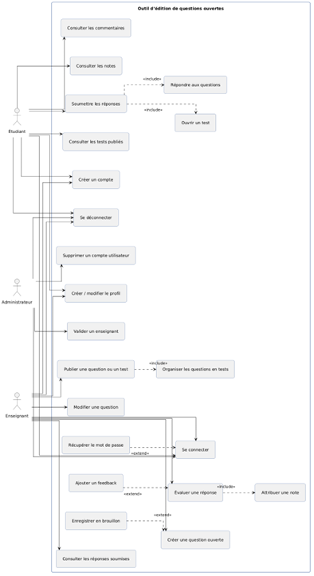
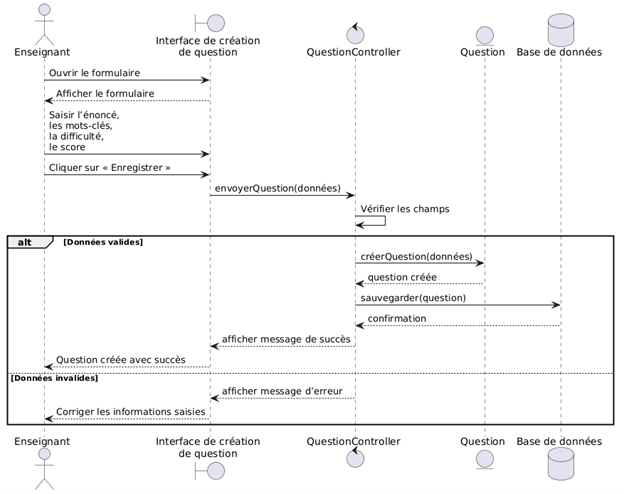
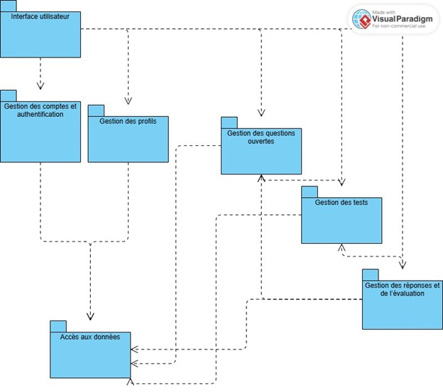

# Outil-Edition-Questions-Ouvertes
Application desktop JavaFX pour la gestion, la consultation et l’évaluation de questions ouvertes.

<h1 align="center"><strong>Outil d’édition de questions ouvertes</strong></h1>
<h3 align="center">Application desktop JavaFX pour la gestion, la consultation et l’évaluation de questions ouvertes</h3>

<div align="center">

**Auteurs :** OLARU Livia & POPESCU Ana-Ioana 
**Groupe :** 1231FA  
**Université :** Université Nationale de Science et Technologie POLITEHNICA Bucarest  
**Faculté :** Faculté d’Ingénierie en Langues Étrangères

</div>

## TABLE DES MATIÈRES

- [DESCRIPTION](#description)
- [ACTEURS DU SYSTÈME](#acteurs-du-système)
- [FONCTIONNALITÉS PRINCIPALES](#fonctionnalités-principales)
- [ARCHITECTURE](#architecture)
- [COMPOSANTES LOGICIELLES](#composantes-logicielles)
- [RÈGLES MÉTIER](#règles-métier)
- [TECHNOLOGIES ET BIBLIOTHÈQUES](#technologies-et-bibliothèques)
- [ORGANISATION DU PROJET](#organisation-du-projet)

---

## DESCRIPTION

Le projet **« Outil d’édition de questions ouvertes »** consiste en le développement d’une application desktop réalisée en **JavaFX**. Son objectif est de moderniser et d'optimiser le processus de création pédagogique et d'évaluation. L'application permet aux enseignants de concevoir des questions ouvertes complexes, de les organiser en tests, et d'évaluer les soumissions des étudiants de manière structurée.

---

## ACTEURS DU SYSTÈME

* **Étudiant** : Il crée son compte, consulte les tests publiés, soumet ses réponses aux questions ouvertes et visualise ses notes ainsi que les feedbacks reçus.
* **Enseignant** : Acteur principal de la création de contenu. Il conçoit les questions, organise les tests, publie le matériel pédagogique et évalue les réponses des étudiants.
* **Administrateur** : Il assure la gestion des utilisateurs, valide les comptes des enseignants et peut supprimer des comptes pour maintenir l'intégrité de la plateforme.

---
---

## ARCHITECTURE ET DIAGRAMMES

### Diagramme de Cas d'Utilisation
  
*Ce diagramme illustre les interactions entre l'Étudiant, l'Enseignant et l'Administrateur.*

### Diagramme de Séquence : Création d'une question
  
*Détail technique du flux d'enregistrement d'une nouvelle question dans la base de données.*

### Diagramme de Paquets
  
*Organisation modulaire du système (Interface, Services, DAO).*

---

## FONCTIONNALITÉS PRINCIPALES

### Fonctionnalités de l'Enseignant
- **Gestion des Questions** : Création et modification de questions avec titre, énoncé, niveau de difficulté et score maximum.
- **Organisation des Tests** : Regroupement de questions dans des tests spécifiques et gestion de leur publication.
- **Évaluation** : Consultation des réponses soumises, ajout de feedback (commentaires) et attribution de notes finales.

### Fonctionnalités de l'Étudiant
- **Participation** : Consultation des tests publiés et rédaction des réponses.
- **Suivi** : Consultation des résultats obtenus et lecture des feedbacks de l'enseignant.

---

## ARCHITECTURE

L'application suit une architecture **MVC (Model-View-Controller)** pour garantir une séparation claire entre l'interface utilisateur, la logique métier et l'accès aux données.

### Organisation Modulaire
- **Interface Utilisateur** : Définie par des fichiers FXML et stylisée avec CSS.
- **Contrôleurs** : Gèrent les interactions entre la vue et les services (ex: `QuestionController`, `AuthController`).
- **Services Métier** : Implémentent la logique applicative (ex: `QuestionService`, `AuthService`).
- **Accès aux Données (DAO)** : Gère la persistance des informations dans la base de données via JDBC.

---

## COMPOSANTES LOGICIELLES

| Couche | Rôle | Exemples |
| :--- | :--- | :--- |
| **View** | Interface graphique et interaction | `QuestionView`, `LoginView`, `DashboardView` |
| **Controller** | Coordination et traitement des actions | `QuestionController`, `AuthController`, `EvaluationController` |
| **Service** | Logique métier et validation | `QuestionService`, `AuthService`, `EvaluationService` |
| **Modèles** | Entités de données principales | `User`, `Question`, `Test`, `Evaluation` |
| **Database** | Stockage persistant | MySQL / Base de données relationnelle |

---

## RÈGLES MÉTIER

Les règles métier (Business Rules - BR) encadrent le fonctionnement logique du système :

1.  **Validation Enseignant** : Un compte enseignant est créé initialement avec des restrictions ; certaines fonctionnalités pédagogiques ne sont accessibles qu'après validation par l'administrateur.
2.  **Unicité des Identifiants** : Chaque utilisateur doit disposer d'une adresse e-mail valide et unique dans le système.
3.  **Gestion des États** : Une question ou un test est enregistré par défaut à l'état "brouillon" et doit être explicitement "publié" pour être visible par les étudiants.
4.  **Intégrité de la Notation** : La note attribuée à une réponse ne peut jamais dépasser le score maximum défini lors de la création de la question.
5.  **Sécurité des Mots de Passe** : Lors de l'inscription, le système vérifie que le mot de passe et sa confirmation correspondent parfaitement.
6.  **Clôture des Tests** : Il est impossible de modifier une évaluation ou d'ajouter un feedback si le test associé est déjà clôturé ou verrouillé.

---

## TECHNOLOGIES ET BIBLIOTHÈQUES

- **Langage** : Java 
- **Interface Graphique** : JavaFX / FXML / CSS 
- **Persistance des Données** : JDBC / MySQL 
- **Modélisation UML** : Cas d'utilisation, activité, séquence et paquets 
- **Gestion de Version** : GitHub

---

## ORGANISATION DU PROJET

```text
Outil-Edition-Questions-Ouvertes/
│
├── README.md         # Documentation principale
├── LICENSE           # Licence du projet
│
├── images/           # Captures d'écran des diagrammes UML (Cas d'utilisation, Séquence, etc.)
│
├── src/
│   ├── view/         # Fichiers d'interface graphique (FXML, CSS)
│   ├── controller/   # Logique des contrôleurs
│   ├── service/      # Logique métier et validation
│   ├── model/        # Classes entités (User, Question, Test)
│   └── dao/          # Objets d'accès aux données (SQL)
│
└── docs/             # Rapports de projet et documentation complémentaire
